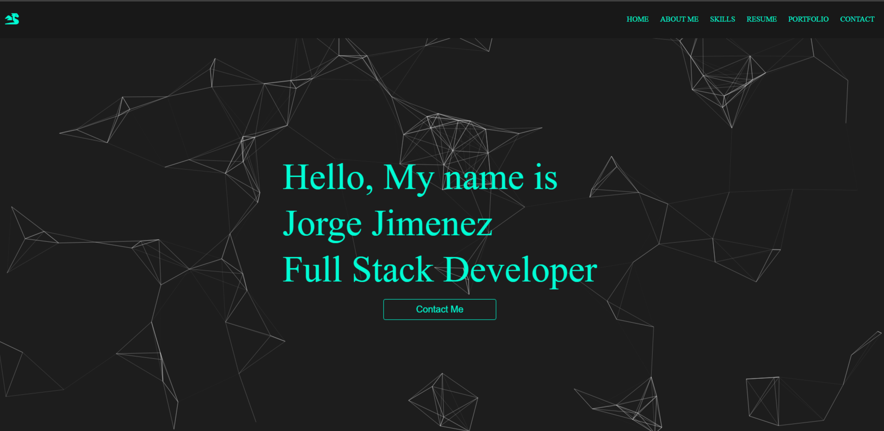

# Jorge Jimenez React Portfolio

## Description

This is the latest iteration of my portfolio, revived and built with React and my practice using SCSS. It acts as a showcase for my web development projects and offers ways to contact me all in one place.

## Usage/Preview

My portfolio is a single-page application. Users can render different sections by clicking the tabs at the top of the page. There are six pages: Home, About Me, Skills, Resume, Portfolio, and Contact. 

The 'Home' page is the default landing page for the app with a button to take the user to Contact. 'About Me' gives some basic info about me and some contact info. 'Skills' shows some of my skills and my proficiency in said skills with A link to my resume at the bottom. 'Portfolio' has links and pictures to all of my projects I have worked on and developed.'Contact' contains a form for contacting me, though it is not functional yet, but I did add my github and linkedin links with SocialIcons.

Live: [jorgejimenez5150.netlify.app](https://jorgejimenez5150.netlify.app//)

## Technologies Used
* React.js
* SCSS

## Credits

* React Docs
* React Simple Animate Docs for good info on its animations

## License

N/A

